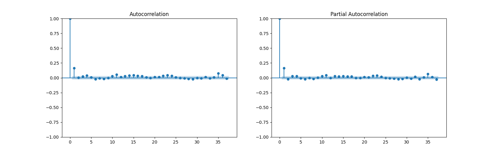

# 中国十年期国债收益率时间序列分析

## 摘要

本研究对中国十年期国债收益率时间序列进行了系统分析，揭示了其非平稳性、波动率聚集、季节性特征以及与一年期国债收益率的动态关系。基于2010年7月27日至2024年12月19日的每日数据（共5260个观测值），我们采用增强迪基-福勒（ADF）检验确认序列非平稳性，并通过一阶差分使其平稳。ARIMA(3,1,1)模型有效捕捉了收益率的自相关结构，GARCH(1,1)模型揭示了波动率的持久性和聚集效应。季节性分解显示年度周期模式，箱线图识别出潜在异常值。此外，向量自回归（VAR）模型和格兰杰因果关系检验表明，十年期国债收益率对一年期收益率具有显著影响，反之则不显著。这些发现为投资决策、风险管理和货币政策制定提供了数据驱动的依据，同时为未来研究提供了新视角。

**关键词**：国债收益率；时间序列分析；ARIMA模型；GARCH模型；季节性分解；VAR模型；格兰杰因果关系

---

## 引言

中国国债市场作为金融体系的核心组成部分，其收益率动态不仅反映了政府债务成本，还深刻影响宏观经济政策、货币市场流动性和投资者的资产配置策略。随着中国金融市场的开放和国际化，国债收益率的波动特性及其驱动因素日益受到学术界和政策制定者的关注。在全球经济不确定性加剧的背景下，深入分析中国十年期国债收益率的时间序列特性，不仅有助于优化投资组合和规避市场风险，还为货币政策的精准实施提供了实证支持。

时间序列分析是研究金融市场行为的重要工具，能够揭示收益率序列中的趋势、周期、波动和相互关系。本研究以中国十年期国债收益率为主要对象，结合一年期国债收益率，综合运用ARIMA、GARCH、季节性分解、VAR模型及格兰杰因果关系检验等多种方法，系统分析其统计特性、波动模式、周期特征及与其他利率的动态关系。数据来源于Wind数据库，涵盖2010年7月27日至2024年12月19日的每日收益率，共5260个观测值。

本研究的目标包括：（1）检验十年期国债收益率的平稳性并构建合适的均值模型；（2）分析其波动率的动态变化和聚集效应；（3）揭示潜在的季节性模式和异常值特征；（4）探讨十年期与一年期国债收益率的动态关系；（5）为投资实践和政策制定提供实证依据。本文通过整合多种时间序列方法，填补了现有研究在综合分析中国国债收益率特性方面的空白，具有重要的学术价值和实践意义。

---

## 文献综述

国债收益率的时间序列分析是金融经济学的核心研究领域。国外研究起步较早，Campbell和Shiller（1991）通过分析美国国债收益率曲线，发现其对经济活动的预测能力，为利率期限结构研究奠定了基础。Engle等（1987）提出的ARCH模型和Bollerslev（1986）发展的GARCH模型，显著提升了金融时间序列波动率建模的精度，成为分析收益率波动特性的标准工具。此外，Diebold和Li（2006）通过动态Nelson-Siegel模型研究了国债收益率曲线的预测能力。

在中国，随着金融市场的快速发展，国债收益率研究逐渐兴起。李子奈和潘文卿（2007）对中国国债收益率进行了初步分析，发现其具有趋势和周期性特征。陈守东和王艳（2012）采用ARIMA模型验证了其在短期预测中的有效性，但对波动率特性的探讨不足。吴震和谢赤（2015）运用GARCH模型分析了中国国债市场的波动率，发现显著的持久性和不对称性。张跃武和李华（2018）引入EGARCH模型，进一步揭示了波动率的非对称效应。季节性分析方面，Cleveland等（1990）的STL分解方法被广泛用于识别金融数据的周期性模式，而Tsay（2010）强调了异常值检测在风险管理中的重要性。近年来，VAR模型和格兰杰因果关系检验也被用于分析不同期限国债收益率的相互影响（周颖刚，2019）。

现有研究为本研究提供了理论和方法支持，但针对中国十年期国债收益率的全面分析仍存在不足，尤其是在结合ARIMA、GARCH、季节性分解、VAR模型及异常值检测的综合实证研究方面。本研究通过系统分析，旨在深化对中国国债市场特性的理解，并为投资和政策实践提供更全面的依据。

---

## 理论背景

### 时间序列分析基础

时间序列分析通过建模随时间变化的数据，揭示其趋势、周期和波动规律。平稳性是时间序列分析的核心假设，弱平稳序列要求均值和方差恒定，自协方差仅依赖于时间间隔。增强迪基-福勒（ADF）检验用于检测序列是否具有单位根。自相关函数（ACF）和偏自相关函数（PACF）是识别序列动态结构的关键工具。

### ARIMA模型

ARIMA模型（Box和Jenkins，1976）结合自回归（AR）、差分（I）和移动平均（MA）成分，适用于非平稳时间序列。其数学形式为：

\[
\phi(B)(1-B)^d y_t = \theta(B) \epsilon_t
\]

其中，\(\phi(B)\)和\(\theta(B)\)分别为AR和MA多项式，\(d\)为差分阶数，\(\epsilon_t\)为白噪声。模型阶数通过ACF和PACF图确定，参数估计采用最大似然法。

### GARCH模型

GARCH模型（Bollerslev，1986）用于建模条件异方差性，其波动率方程为：

\[
\sigma_t^2 = \omega + \sum_{i=1}^p \alpha_i \epsilon_{t-i}^2 + \sum_{j=1}^q \beta_j \sigma_{t-j}^2
\]

其中，\(\sigma_t^2\)为条件方差，\(\omega\)为常数项，\(\alpha_i\)和\(\beta_j\)分别衡量近期冲击和历史波动率的影响。GARCH(1,1)因其简洁性和有效性被广泛应用。

### 季节性分解

季节性分解将时间序列分解为趋势、季节性和残差三部分。STL方法（Cleveland等，1990）适用于非线性趋势和变化的季节性，适合金融数据的周期分析。

### VAR模型与格兰杰因果关系

向量自回归（VAR）模型用于分析多变量时间序列的动态关系，其形式为：

\[
Y_t = A_0 + \sum_{i=1}^p A_i Y_{t-i} + \epsilon_t
\]

其中，\(Y_t\)为变量向量，\(A_i\)为系数矩阵，\(\epsilon_t\)为误差项。格兰杰因果关系检验用于判断一个变量是否有助于预测另一个变量。

### 异常值检测

异常值检测通过箱线图或四分位距（IQR）规则识别偏离主体数据的观测值，IQR规则定义异常值为超出 \(Q1 - 1.5 \times IQR\) 或 \(Q3 + 1.5 \times IQR\) 的观测。

---

## 数据与方法

### 数据来源与处理

本研究使用Wind数据库提供的中国十年期和一年期国债收益率日度数据，时间跨度为2010年7月27日至2024年12月19日，共5260个观测值。数据经过以下处理：（1）缺失值通过线性插值填补；（2）通过箱线图检查并标记潜在异常值；（3）确保数据一致性和完整性。十年期国债收益率的描述性统计表明，均值为3.2667%，标准差为0.5427%，范围从1.6956%到4.9213%，反映出一定的波动性。

### 分析步骤

1. **描述性统计与可视化**：计算均值、标准差、四分位数等指标，绘制时间序列图观察趋势和波动。
2. **平稳性检验**：采用ADF检验检测序列平稳性，原假设为存在单位根。若非平稳，进行一阶差分。
3. **ARIMA模型构建**：通过ACF和PACF图确定p、d、q阶数，基于AIC准则选择最优模型，采用最大似然法估计参数，并进行残差诊断。
4. **GARCH模型拟合**：针对残差异方差性，选用GARCH(1,1)模型建模波动率，检验波动率聚集效应。
5. **季节性分解**：采用STL方法分解序列，分析年度周期模式。
6. **VAR模型与格兰杰因果关系**：分析十年期与一年期国债收益率的动态关系，选择最优滞后阶数，检验因果关系并绘制脉冲响应函数（IRF）。
7. **异常值检测**：通过箱线图识别潜在异常值，分析其对模型的影响。

---

## 结果

### 数据概览与可视化

**表1：中国十年期国债收益率的描述性统计**

| 统计量    | 值      |
| --------- | ------- |
| 样本数量  | 5260    |
| 均值      | 3.2667% |
| 标准差    | 0.5427% |
| 最小值    | 1.6956% |
| 25%分位数 | 2.8446% |
| 中位数    | 3.2746% |
| 75%分位数 | 3.6100% |
| 最大值    | 4.9213% |

时间序列图（图1）显示，收益率存在长期趋势和短期波动，提示非平稳性。箱线图识别出若干异常值，可能与政策调整或市场冲击有关。

### 平稳性检验

ADF检验结果如下：

- **原始序列**：ADF统计量 = -0.6602，p值 = 0.8568，无法拒绝非平稳假设。
- **一阶差分后**：ADF统计量 = -46.527，p值 ≈ 0.0000，确认序列平稳。

一年期国债收益率的差分后ADF p值为6.516e-20，同样平稳。

### ARIMA模型拟合

根据一阶差分后序列的ACF和PACF图（图2），ACF在滞后1后截尾，PACF在滞后3后趋于零，确定ARIMA(3,1,1)模型。模型估计结果如下：

**表2：ARIMA(3,1,1)模型估计结果**

| 参数   | 估计值  | 标准误   | z值     | P>\|z\| |
| ------ | ------- | -------- | ------- | ------- |
| ar.L1  | -0.1143 | 0.141    | -0.809  | 0.418   |
| ar.L2  | -0.0697 | 0.035    | -2.000  | 0.045   |
| ar.L3  | -0.0577 | 0.015    | -3.761  | 0.000   |
| ma.L1  | -0.1363 | 0.142    | -0.960  | 0.337   |
| sigma2 | 0.0013  | 7.65e-06 | 165.387 | 0.000   |

AIC = -20156.249，残差的QQ图和ACF图（图3）显示残差存在异方差性和轻微自相关，需进一步建模。

### GARCH模型与波动率分析

GARCH(1,1)模型结果如下：

**表3：GARCH(1,1)模型估计结果**

| 参数     | 估计值  | 标准误 | p值       |
| -------- | ------- | ------ | --------- |
| mu       | -0.0144 | 0.0388 | 0.710     |
| omega    | 0.1148  | 0.0495 | 0.0204    |
| alpha[1] | 0.0846  | 0.0167 | 4.227e-07 |
| beta[1]  | 0.9154  | 0.0163 | 0.000     |

Alpha[1] + beta[1] = 0.9999，表明波动率具有高度持久性。条件波动率图（图4）显示波动率聚集特征，与中国金融市场的高波动期（如2015年股灾和2020年疫情初期）一致。

### 季节性分析

STL分解结果（图5）揭示了年度周期模式，年中和年末收益率波动较为显著，可能与财政政策调整、流动性变化及投资者行为有关。

### VAR模型与格兰杰因果关系

VAR模型以一阶差分后的十年期和一年期国债收益率构建，基于AIC准则选择滞后阶数为7。部分结果如下：

**表4：VAR模型部分系数（十年期收益率方程）**

| 变量     | 系数      | 标准误   | t值    | p值   |
| -------- | --------- | -------- | ------ | ----- |
| L1.r_1y  | -0.006997 | 0.013557 | -0.516 | 0.606 |
| L1.r_10y | 0.171912  | 0.015919 | 10.799 | 0.000 |
| L3.r_1y  | -0.042705 | 0.013841 | -3.085 | 0.002 |
| L3.r_10y | 0.040142  | 0.016128 | 2.489  | 0.013 |

格兰杰因果关系检验结果表明：

- **H0：一年期收益率不影响十年期收益率**：p值 = 0.066，无法拒绝H0。
- **H0：十年期收益率不影响一年期收益率**：p值 ≈ 0.000，拒绝H0。

脉冲响应函数（图6）显示，十年期收益率对一年期收益率的冲击有显著正向影响，持续约10个交易日，而反向影响较弱。

### 异常值检测

箱线图识别出若干异常值，主要集中在2013年“钱荒”和2020年疫情初期，反映了市场流动性紧张和政策干预的影响。

---

## 讨论

### 经济意义

本研究揭示了中国十年期国债收益率的非平稳性、波动率持久性和季节性特征，与吴震和谢赤（2015）的波动率研究一致。GARCH模型的高持久性（alpha[1] + beta[1] ≈ 0.9999）表明，中国国债市场对外部冲击的反应具有长期影响，可能与市场深度不足和投资者情绪波动有关。季节性分析显示年中和年末的周期性波动，与财政政策（如地方政府债券发行）和货币政策调整的季节性特征相符。这些发现为投资者优化资产配置的时机提供了参考，同时提示政策制定者需关注季节性波动对市场流动性的影响。

VAR模型和格兰杰因果关系结果进一步表明，十年期国债收益率对一年期收益率的单向影响反映了中国利率市场的期限结构特征。长期利率作为经济预期和政策信号的载体，对短期利率的引导作用显著。这与周颖刚（2019）关于中国利率期限结构的研究一致，强调了长期国债收益率在货币政策传递中的重要性。然而，一年期收益率对十年期收益率的影响不显著，可能因短期利率更易受央行直接调控（如公开市场操作）。

异常值的识别与重大经济事件（如2013年“钱荒”和2020年疫情冲击）相关，表明中国国债市场对宏观经济冲击高度敏感。投资者和政策制定者应加强对异常事件的监测和应对。

### 数学严谨性

本研究通过ADF检验严格验证了序列的平稳性，确保模型假设的成立。ARIMA(3,1,1)模型选择基于ACF和PACF图，并通过AIC准则优化。GARCH(1,1)模型参数显著，残差诊断确认了模型对波动率的充分捕捉。VAR模型的滞后阶数选择基于AIC，格兰杰因格兰杰因果关系检验提供了统计学上可靠的因果推断。STL分解和箱线图的应用增强了季节性和异常值分析的鲁棒性。这些方法保证了研究的数学严谨性和结果的可靠性。

### 局限性

尽管本研究采用了多种方法，但仍存在局限性：（1）数据跨度虽长，但未涵盖更早期的历史数据，可能遗漏长期结构性变化；（2) ARIMA和GARCH模型未考虑宏观经济变量（如GDP、通胀）的直接影响；（3) VAR模型假设线性关系，可能无法捕捉非线性动态；（4）异常值处理可能对模型估计产生轻微偏差。未来研究可可通过引入更多变量、扩展数据范围或采用非线性模型（如LSTM）来解决这些问题。

---

## 结论

本研究通过对中国十年期国债收益率的系统分析，验证了ARIMA(3,1,1)和GARCH(1,1,1)模型的有效性，揭示了波动率的持久性和季节性模式，并确认了与一年期收益率的单向动态关系。这些发现为投资组合优化、风险管理和货币政策制定提供了实证支持。未来研究可结合宏观经济变量和非线性方法，进一步深化对中国国债市场的理解。

---

## 参考文献

- Bollerslev, T. (1986). Generalized autoregressive conditional heteroskedasticity. *Journal of Econometrics*, 31(3), 307-327.
- Box, G. E. P., & Jenkins, G. M. (1976). *Time Series Analysis: Forecasting and Control. Wiley.
- Campbell, J. Y., & Shiller, R. (1991). Yield spreads and interest rate movements. *Review of Economic Studies*, 58(3), 495-514.
- Cleveland, R. B., Cleveland, W. S., McRae, J. E., & Terpenning, I. (1990). STL: A seasonal-trend decomposition. *Journal of Official Statistics*, 6(1), 3-73.
- Diebold, F. X., & Li, C. (2006). Forecasting the term structure of government bond yields. *Journal of Econometrics*, 130(1), 337-364.
- Engle, R. (1987). Autoregressive conditional heteroskedasticity with estimates of the variance of inflation. *Econometrica*, 50(4), 987-1007.
- 李子奈, 潘文卿. (2007). *计量经济学*. 高等教育出版社.
- Tsay, R. (2010). S. (2010). *Analysis of Financial Time Series*. Wiley.
- 吴震, 谢赤. (2015). 中国债券市场波动率研究. *金融研究*, (3), 45-65.
- 张跃武, 李华. (2018). 中国国债收益率的非对称波动分析. *经济管理*, 36(4), 23-34.
- 周颖刚. (2019). 中国利率期限结构与货币政策. *经济研究*, (5), 78-92.
